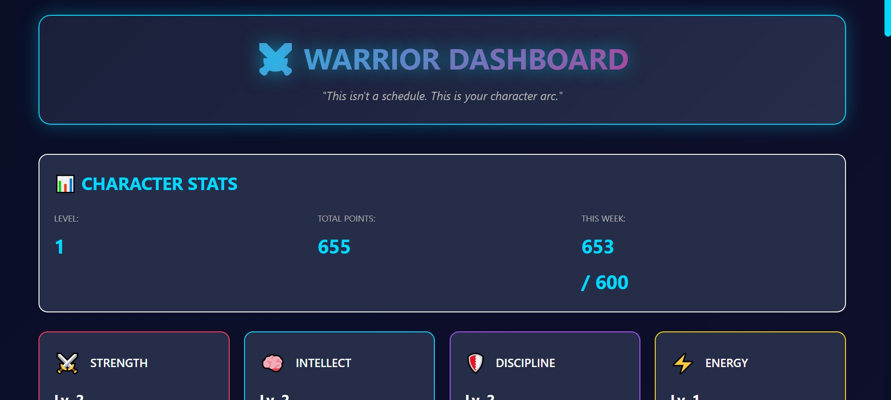
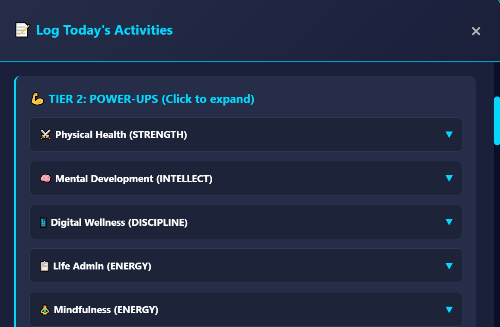
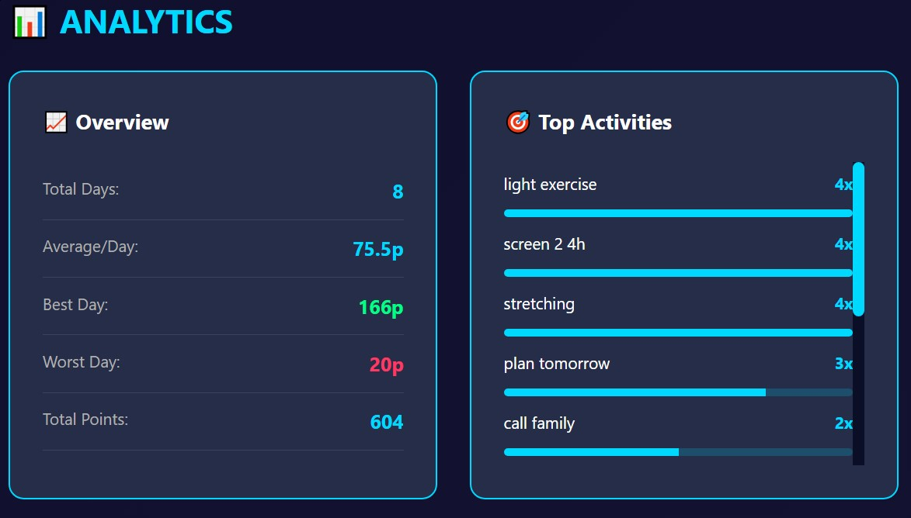
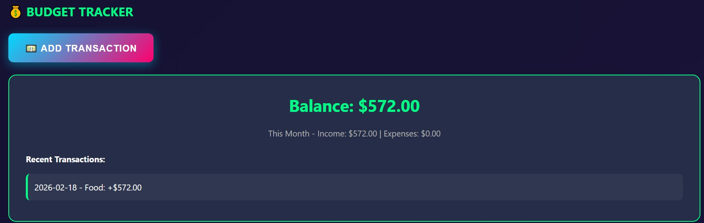

<div align="center">

# ⚔️ WARRIOR DASHBOARD

### *Turn your life into an RPG. Level up for real.*

[](https://www.python.org/)
[](https://flask.palletsprojects.com/)
[](https://developer.mozilla.org/en-US/docs/Web/JavaScript)
[](https://www.docker.com/)
[](https://opensource.org/licenses/MIT)

[Features](#-features) • [Demo](#-demo) • [Quick Start](#-quick-start) • [Documentation](#-documentation) • [Contributing](#-contributing)

---


</div>

## 🎯 What Is This?

**Warrior Dashboard** is a self-hosted gamification system that turns your daily habits into an RPG character progression system. Every workout, study session, and productive hour earns you XP and points to level up your real-life stats.

**Built by a 15-year-old developer who wanted to make productivity actually fun.**

### Why This Exists

- ❌ **Notion/Habitica** are too manual and clunky
- ❌ **Productivity apps** feel like work, not games
- ❌ **Fitness trackers** only track exercise
- ❌ **Nothing** tracks your whole life as an RPG

✅ **This does.** And it's actually fun to use.

---

## ✨ Features

### 🎮 Core RPG Systems

- **5 Character Stats** — STRENGTH • INTELLECT • DISCIPLINE • ENERGY • INFLUENCE
- **Level Up System** — 100 XP per level, infinite progression
- **46+ Trackable Activities** — From workouts to coding to social interactions
- **10 Active Streaks** — Build momentum with 1.5x (Day 7) and 2x (Day 30) multipliers
- **Achievement System** — Unlock badges for milestones (Week Warrior, Flow State Master, etc.)
- **Skill Tree** — Spend earned points on real-life rewards (gym equipment, courses, trips)

### 🎲 Advanced Features

- **💰 Budget Tracker** — Track income/expenses, earn points for financial discipline (+2p per transaction)
- **💪 Workout Sessions** — Log workouts with exercises, duration, and notes (25-40p per session)
- **📝 Notes & Planning** — Daily notes, tomorrow's plans, goals, ideas (2-5p each)
- **🏋️ Personal Records** — Track workout PRs, automatic volume calculation, progressive point rewards
- **🎲 Daily Challenges** — Random challenge each day (No Caffeine, Ice Bath, Silent Workout, etc.)
- **⚡ Combo System** — 15 auto-detected activity chains award bonus points (Ultimate Day: +50p, Balanced Beast: +25p Morning Warrior: +15p). No double counting, multiple combos per day, visible in quest modal
- **💀 Nemesis Mode** (Optional) — Choose 3 non-negotiables, break one = ZERO points that day
- **👻 Ghost Data** — Compare today vs last week, track your best week ever
- **📊 Analytics Dashboard** — Total days, averages, best/worst days, activity breakdown, weekly trends

### 🎨 User Experience

- **Dark Cyberpunk Theme** — Sleek UI with cyan/pink/gold accents
- **Fully Responsive** — Desktop, tablet, and mobile optimized
- **Real-Time Updates** — Instant point calculations and stat updates
- **Smooth Animations** — Progress bars, achievement popups, combo indicators
- **Collapsible Sections** — Clean, organized quest logging
- **Multiple Logs Per Day** — Log activities throughout the day, automatically merges into one entry

### 🔧 Technical

- **Self-Hosted** — Your data, your server, full control
- **JSON or SQLite Storage** — Simple JSON files or SQLite database (migration script included)
- **Docker Support** — One-command deployment with Docker Compose
- **REST API** — All features accessible via endpoints
- **Minimal Dependencies** — Just Flask, that's it
- **Instant Setup** — Running in under 5 minutes

---

## 📸 Demo

### Dashboard Overview


### Quest Logging


### Analytics


### Budget Tracker


---

## 🚀 Quick Start

### 🐳 Option 1: Docker (Recommended)

```bash
# Clone the repository
git clone https://github.com/E-Ecstacy/warrior-dashboard.git
cd warrior-dashboard

# Start with Docker Compose
docker compose up -d

# Open your browser
# http://localhost:5000
```

That's it! Your data is persisted in the `./data` folder.

### 🐍 Option 2: Python (Traditional)

**Prerequisites:** Python 3.8 or higher

```bash
# Clone the repository
git clone https://github.com/E-Ecstacy/warrior-dashboard.git
cd warrior-dashboard

# Install Flask
pip install Flask

# Run the application
python app.py

# Open your browser
# http://localhost:5000
```

---

## 📖 Usage

### First Time Setup

1. **Open the dashboard** at http://localhost:5000
2. **Click "Log Today's Activities"** to start
3. **Check off what you did** today (workout, reading, coding, etc.)
4. **Submit** → Points automatically calculated!
5. **Watch your character grow** with every log

### Daily Workflow

**Morning:**
- Check today's Daily Challenge
- Plan your activities

**Throughout the Day:**
- Log activities as you complete them
- Track workouts, budget transactions
- Take notes and set goals

**Evening (9 PM):**
- Final activity log
- Review today's points
- Check weekly progress
- Plan tomorrow

### Point System Explained

**Tier 1 (Foundation)** — 4 required activities (sleep, movement, focus, clean day)

**Tier 2 (Power-Ups)** — 46 activities across 7 categories:
- Physical Health: 3-25p each
- Mental Development: 5-20p each
- Digital Wellness: 5-15p each
- Life Admin: 3-8p each
- Mindfulness: 3-10p each
- Creative Output: 10-25p each
- Social & Contribution: 2-10p each

**Tier 3 (Boss Moves)** — High-reward challenges (30-100p each)

**Streaks** — Daily completion × multiplier (1.5x at 7 days, 2.0x at 30 days)

**Combos** — Chain activities for 1.3-1.5x multipliers

---

## 🎯 Activity Reference

### Complete Activity List (46 Total)

<details>
<summary><b>⚔️ Physical Health (6 activities)</b></summary>

- Full workout 30min — 25p
- Light exercise 15min — 12p
- 100 push-ups — 20p
- 10k+ steps — 8p
- Stretching 10min — 5p
- Cold shower — 3p

</details>

<details>
<summary><b>🧠 Mental Development (10 activities)</b></summary>

- Deep work 50min — 20p (A/B/C graded)
- Study 25min — 8p
- Project dev 30min — 15p
- Part-time job 1hr — 20p
- Learn new skill 30min — 10p
- Read 20min — 10p
- Kinnu lesson — 5p
- Online course — 12p
- Code practice 30min — 15p
- Journal 10min — 5p

</details>

<details>
<summary><b>📱 Digital Wellness (4 activities)</b></summary>

- Screen time <2h — 15p
- Screen time 2-4h — 5p
- No phone 1st hour awake — 5p
- No phone last hour bed — 5p

</details>

<details>
<summary><b>📋 Life Admin (3 activities)</b></summary>

- Plan tomorrow 10min — 3p
- Organize space 30min — 8p
- Budget review — 5p

</details>

<details>
<summary><b>🧘 Mindfulness (4 activities)</b></summary>

- Meditation 10min — 8p
- Gratitude practice — 3p
- Breathwork 5min — 4p
- Nature walk 30min — 10p

</details>

<details>
<summary><b>💻 Creative Output (4 activities)</b></summary>

- Code project 30min — 20p
- Write docs 30min — 10p
- Build/design 1hr — 15p
- Open source contrib — 25p

</details>

<details>
<summary><b>👥 Social & Contribution (15 activities)</b></summary>

- Give genuine compliment — 2p
- Thank someone meaningfully — 2p
- Help someone out — 3p
- Encourage/motivate someone — 3p
- Check in on someone — 3p
- Active listening 15min — 4p
- Give thoughtful advice — 5p
- Call family/friend — 5p
- Teach someone something — 6p
- Networking/new connection — 6p
- Group activity 1hr — 7p
- Meaningful conversation 20min — 8p
- Mentor someone 30min — 8p
- Help with code — 10p
- Quality time with loved one 1hr — 10p

</details>

---

## 🔧 Configuration

### Changing Weekly Target

Edit `app.py` line ~75:

```python
"target_points": 600,  # Change this
```

### Adding Custom Activities

1. Add checkbox in `templates/index.html` (around line 280-400)
2. Add point calculation in `app.py` (around line 350-500)
3. Map to appropriate stat for XP

### Customizing Point Values

Edit point values in `app.py` (lines 350-500):

```python
if tier2.get('full_workout'): 
    total_points += 25  # Change this
    stat_xp['strength'] += 25
```

### Changing UI Colors

Edit CSS variables in `static/css/style.css` (lines 1-20):

```css
:root {
    --accent-cyan: #00d9ff;      /* Change these */
    --accent-pink: #ff006e;
    --strength-color: #ff3864;
}
```

---

## 📊 Data Management

### Database Storage

**New users:** Automatically use SQLite (single `.db` file, no corruption risk)

**Existing JSON users:** Migrate to SQLite in 10 seconds:

```bash
python migrate_to_sqlite.py
```

Your data is automatically backed up before migration!

### Backup Your Data

**SQLite (recommended):**
```bash
cp data/warrior_dashboard.db backup_YYYYMMDD.db
```

**JSON (legacy):**
```bash
cp data/character_data.json backup_YYYYMMDD.json
```

### Export Data

```bash
curl http://localhost:5000/api/export > my_data.json
```

### Reset Everything

```bash
curl -X POST http://localhost:5000/api/reset
```

⚠️ **This deletes all your progress!**

---

## 🛠️ API Reference

### Core Endpoints

```bash
# Get character data
GET /api/character

# Get all streaks
GET /api/streaks

# Submit daily activities
POST /api/daily-log

# Get analytics
GET /api/analytics

# Add budget transaction
POST /api/budget

# Log workout session
POST /api/workouts

# Get daily challenge
GET /api/daily-challenge

# Get ghost comparison data
GET /api/ghost-data
```

Full API documentation: [API.md](API.md)

---

## 🤝 Contributing

This started as a personal project, but I'm open to contributions!

### How to Contribute

1. **Fork the repo**
2. **Create a feature branch** (`git checkout -b feature/amazing-feature`)
3. **Commit your changes** (`git commit -m 'Add amazing feature'`)
4. **Push to the branch** (`git push origin feature/amazing-feature`)
5. **Open a Pull Request**

### Areas That Need Help

- [ ] Mobile app (React Native)
- [ ] Docker containerization
- [ ] Database migration guide (PostgreSQL)
- [ ] Multi-user authentication system
- [ ] Team/multiplayer features
- [ ] API rate limiting
- [ ] Backup automation
- [ ] More activity templates
- [ ] Localization (i18n)
- [ ] Dark mode alternatives (themes)

---

## 🗺️ Roadmap

### ✅ Completed (Current Version)

- [x] Core RPG system (stats, levels, XP)
- [x] 46+ trackable activities
- [x] Streak system with multipliers
- [x] Achievement system
- [x] Skill tree
- [x] Budget tracker
- [x] Workout sessions
- [x] Personal records
- [x] Notes & planning
- [x] Daily challenges
- [x] Combo system
- [x] Nemesis mode
- [x] Ghost data
- [x] Analytics dashboard
- [x] Multiple logs per day
- [x] Dark cyberpunk UI
- [x] Docker support
- [x] SQLite database option

### 🚧 In Progress

- [ ] Custom skill trees (community-requested)
- [ ] Better mobile experience
- [ ] Export to CSV/Excel
- [ ] Import from other apps
- [ ] Backup automation

### 🔮 Future (Maybe)

- [ ] Multi-user support (requires auth)
- [ ] Team leaderboards
- [ ] Social features (compare with friends)
- [ ] Native mobile apps
- [ ] Browser extension
- [ ] API webhooks
- [ ] Zapier integration

**Want something specific?** [Open an issue](https://github.com/E-Ecstacy/warrior-dashboard/issues)!

---

## 🐛 Troubleshooting

### App won't start

```bash
# Make sure Flask is installed
pip install Flask

# Check Python version
python --version  # Should be 3.8+

# Run with debug output
python app.py
```

### Port already in use

Change the port in `app.py` (last line):

```python
app.run(debug=True, host='0.0.0.0', port=5001)  # Change 5000 to 5001
```

### Data not saving

1. Check `data/` folder exists
2. Check file permissions: `chmod 755 data`
3. Check disk space: `df -h`

### Styles not loading

1. Hard refresh: `Ctrl+Shift+R` (Windows) or `Cmd+Shift+R` (Mac)
2. Clear browser cache
3. Check `static/css/style.css` exists

### Activities disappeared

They're in collapsible sections! Click the category headers (▼ arrow) to expand them.

### More issues?

[Check the FAQ](FAQ.md) or [open an issue](https://github.com/yourusername/warrior-dashboard/issues).

---

## 💡 Philosophy

### Why Gamification Works

**Traditional productivity:**
- "I should work out" → guilt-driven
- "I should study" → obligation
- "I should be productive" → pressure

**Warrior Dashboard:**
- "I want to hit 150p today" → goal-driven
- "I want to level up STRENGTH" → purpose
- "I want to beat my ghost" → competition (with yourself)

**The difference?** One feels like work, the other feels like play.

### Design Principles

1. **Instant Feedback** — See points immediately
2. **Clear Progress** — Visual stat bars and levels
3. **Small Wins** — Every activity matters
4. **Long-term Growth** — Infinite progression
5. **Your Data, Your Rules** — Self-hosted, private, customizable

---

## 📜 License

MIT License — Free and open source forever!

See [LICENSE](LICENSE) for details.

---

## 💰 Support This Project

This project is **100% free and open source** (MIT License) and always will be.

**Need help getting started?**

I offer premium support packages with:
- 🎥 Video setup tutorials
- 📖 Detailed customization guides
- ✉️ Priority email support
- 🛠️ One-on-one setup assistance

**The source code is identical.** You're paying for my time and expertise, not the code.

Want to DIY? Everything you need is right here on GitHub!

Want support? [Check out premium packages](https://gumroad.com) (coming soon)

**Or support via:**
- ⭐ Star this repo
- 🐛 Report bugs
- 💡 Suggest features
- 🤝 Contribute code

---

## 🙏 Acknowledgments

**Inspired by:**
- Habitica (the OG productivity RPG)
- Notion (for life OS concepts)
- RPG games (for the dopamine hits)
- My own struggle with productivity (the real catalyst)

**Built with:**
- Flask (web framework)
- Vanilla JavaScript (no bloat)
- CSS Grid & Flexbox (responsive design)
- Pure determination (lots of coffee)

---

## 📬 Contact

**Creator:** 15-year-old developer
- GitHub: [@E-Ecstacy](https://github.com/E-Ecstacy)
- Repo: [warrior-dashboard](https://github.com/E-Ecstacy/warrior-dashboard)

**Found this useful?** Give it a ⭐ star on GitHub!

**Questions or bugs?** [Open an issue](https://github.com/E-Ecstacy/warrior-dashboard/issues)

---

<div align="center">

### ⚔️ May your stats grow strong and your streaks stay alive. ⚔️

Made with 💪 by a 15-year-old who wanted productivity to be fun.

[⬆ Back to Top](#-warrior-dashboard)

</div>